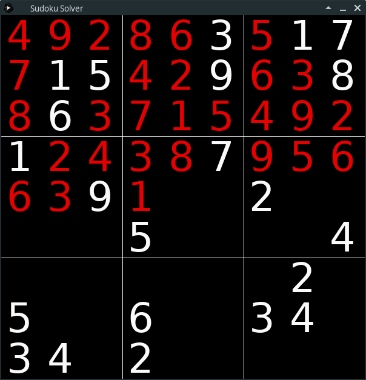

# sudoku
Sudoku solver written in Clojure. 

Finds solutions using depth first search and backtracking. 
There is also additional program to show visual animation of the solving process.  

Included Sudoku puzzles are taken from Project Euler.

### run and solve all the Project Euler P96 puzzles:
```
$ clj -m sudoku
```

### run the animation which randomly and continuously solves included Euler sudokus:
```
$ clj -m animation
```

Screenshot of the animation program:


